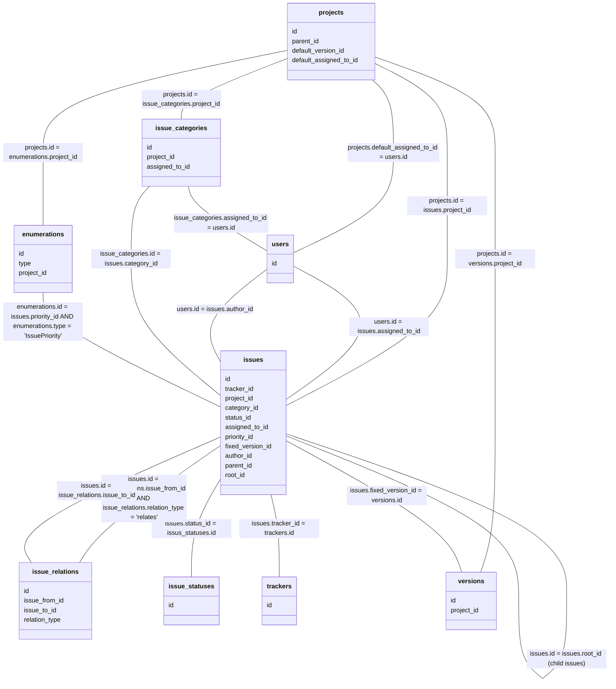
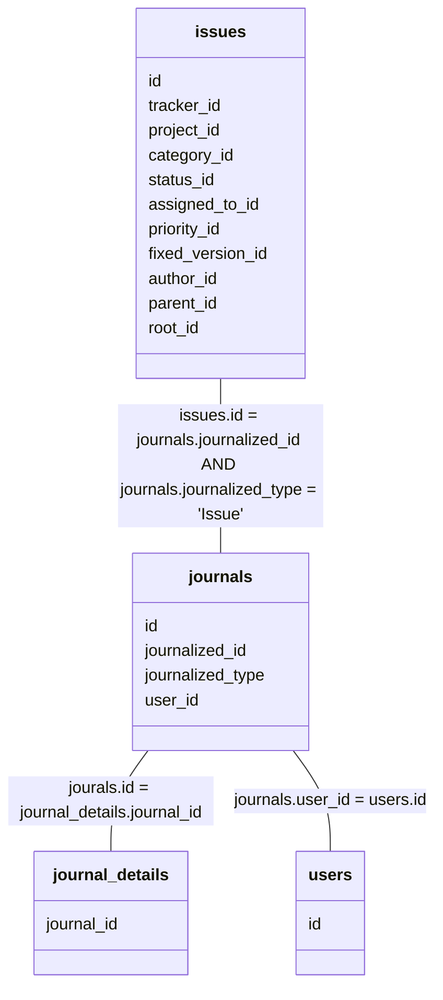
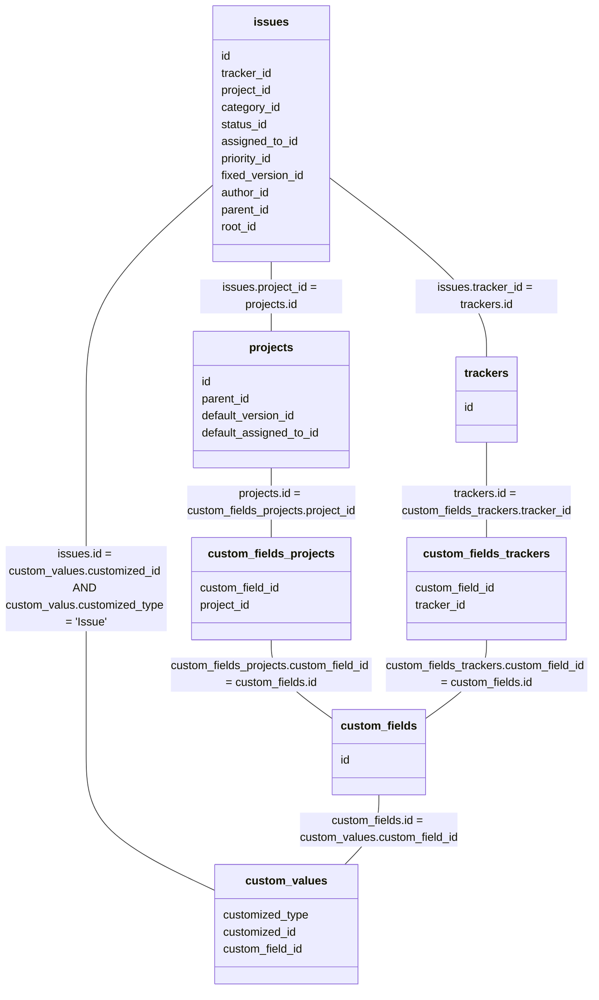
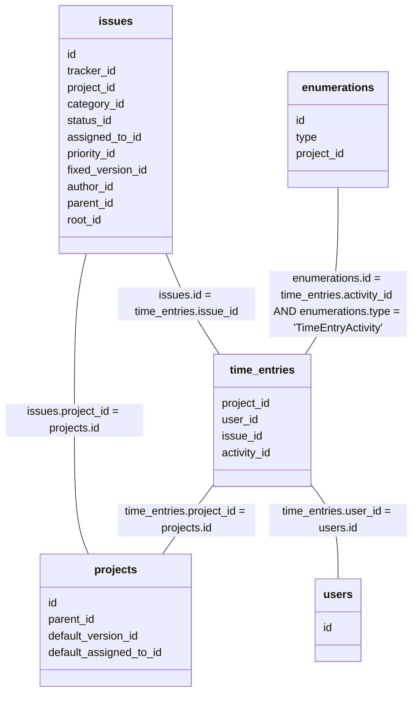
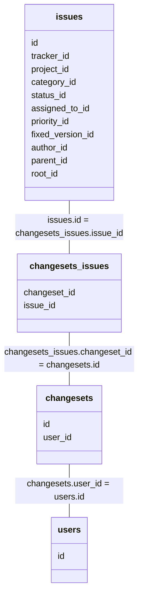
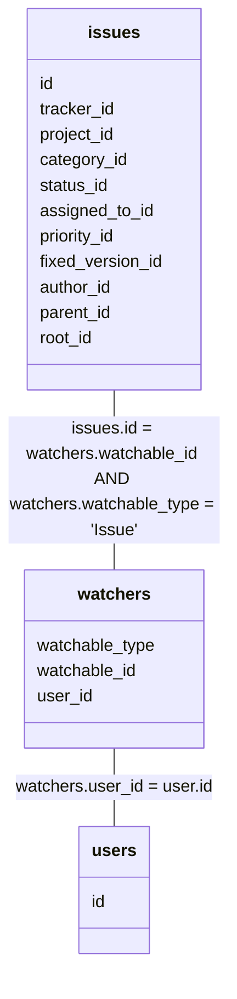
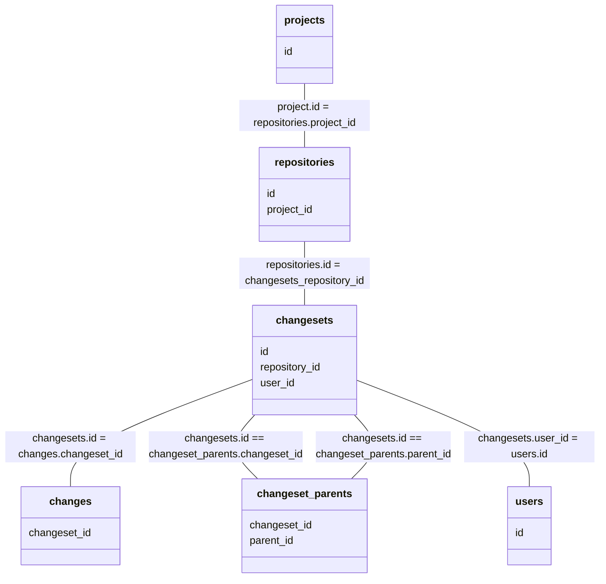
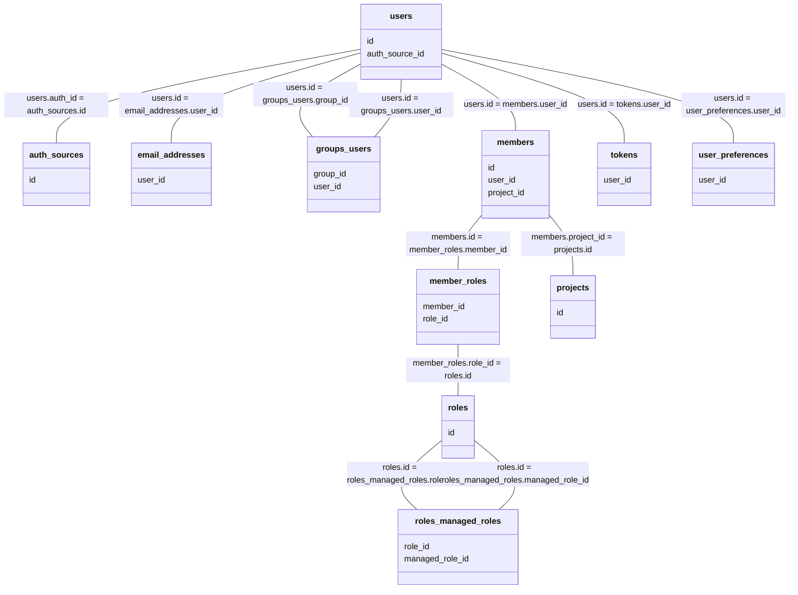
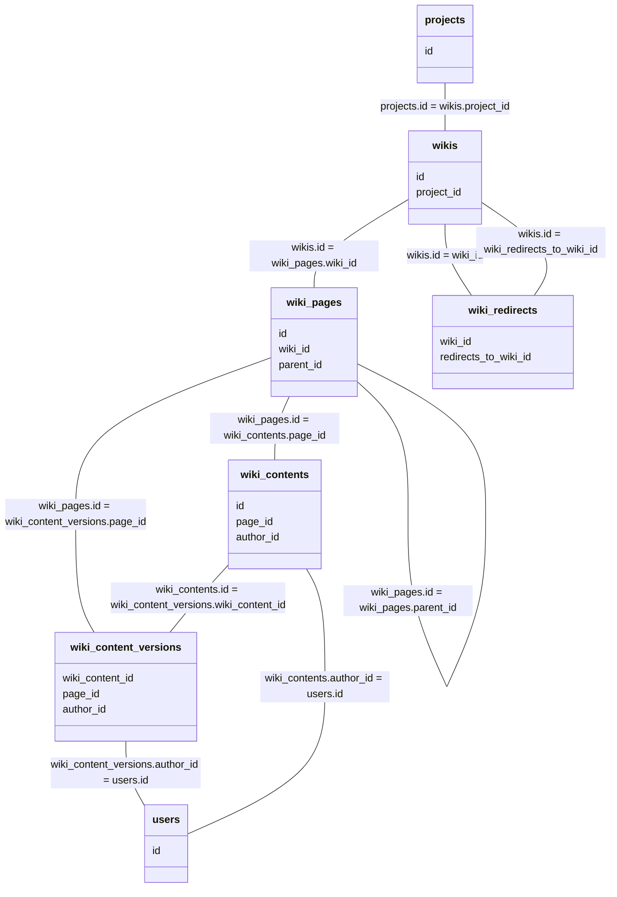

# データベース

## 関連 (チケット)

## 関連 (チケットとコメント)

## 関連 (チケットとカスタムフィールド)

## 関連 (チケットと作業時間)

## 関連 (チケットとリポジトリ)

## 関連 (チケットとウォッチャー)

## 関連 (リポジトリ)

## 関連 (ユーザ)

## 関連 (Wiki)

## auth_sources

| 型       | カラム名          |
| :------: | :---------------: |
| integer  | id                |
| string   | type              |
| string   | name              |
| string   | host              |
| integer  | port              |
| string   | account           |
| string   | account_password  |
| string   | base_dn           |
| string   | attr_login        |
| string   | attr_firstname    |
| string   | attr_lastname     |
| string   | attr_mail         |
| boolean  | onthefly_register |
| boolean  | tls               |
| string   | filter            |
| integer  | timeout           |

## changes

| 型       | カラム名         |
| :------: | :--------------: |
| integer  | id               |
| integer  | changeset_id     |
| string   | action           |
| string   | path             |
| string   | from_path        |
| string   | from_revision    |
| string   | revision         |
| string   | branch           |

## changeset_parents

| 型       | カラム名         |
| :------: | :--------------: |
| integer  | changeset_id     |
| integer  | parent_id        |

## changesets

| 型       | カラム名         |
| :------: | :--------------: |
| integer  | id               |
| integer  | repository_id    |
| string   | revision         |
| string   | committer        |
| datetime | comitted_on      |
| string   | comments         |
| date     | comit_date       |
| string   | scmid            |
| integer  | user_id          |

## changesets_issues

| 型       | カラム名         |
| :------: | :--------------: |
| integer  | changeset_id     |
| integer  | issue_id         |

## custom_fields

| 型       | カラム名         | 備考                     |
| :------: | :--------------: | :----------------------: |
| integer  | id               |                          |
| string   | type             | カスタムフィールドの対象 |
| string   | name             | 名前                     |
| string   | field_format     | 形式                     |
| string   | possible_values  | 選択肢                   |
| string   | regexp           | 正規表現                 |
| integer  | min_length       | 最短長                   |
| integer  | max_length       | 最大長                   |
| boolean  | is_required      | 必須                     |
| boolean  | is_for_adll      | すべてのユーザー         |
| boolean  | is_filter        | フィルタとして使用       |
| integer  | position         |                          |
| boolean  | searchable       | 検索対象                 |
| string   | default_value    | デフォルト値             |
| boolean  | editable         |                          |
| boolean  | visible          | 次のロールのみ           |
| boolean  | multiple         | 複数選択可               |
| string   | format_store     | ※                       |
| string   | description      | 説明                     |

- format_store に yaml 形式で保存される。
  - edit_tag_style: 表示 (ドロップダウンリスト: ''、チェックボックス: check_box)
  - extensions_allowed: 許可する拡張子
  - full_width_layout: ワイド表示 ('', '1')
  - text_formatting: テキスト書式 ('', '1')
  - url_pattern: 値に設定するリンクURL
  - user_role: ロール (形式がユーザの場合)
  - version_status: ステータス (形式がバージョンの場合)

## custom_fields_projects

| 型       | カラム名         |
| :------: | :--------------: |
| integer  | custom_field_id  |
| integer  | project_id       |

## custom_fields_trackers

| 型       | カラム名         |
| :------: | :--------------: |
| integer  | custom_field_id  |
| integer  | tracker_id       |

## custom_values

| 型       | カラム名         |
| :------: | :--------------: |
| integer  | id               |
| string   | customized_type  |
| integer  | customized_id    |
| integer  | custom_field_id  |
| string   | value            |

## email_addresses

| 型       | カラム名         |
| :------: | :--------------: |
| integer  | id               |
| integer  | user_id          |
| string   | address          |
| boolean  | is_default       |
| boolean  | notify           |
| datetime | created_on       |
| datetime | updated_on       |

## enumerations

| 型       | カラム名         |
| :------: | :--------------: |
| integer  | id               |
| string   | name             |
| integer  | position         |
| boolean  | is_default       |
| string   | type             |
| boolean  | active           |
| integer  | project_id       |
| integer  | parent_id        |
| string   | position_name    |

## groups_users

| 型       | カラム名         |
| :------: | :--------------: |
| integer  | group_id         |
| integer  | user_id          |

## issue_categories

| 型       | カラム名         |
| :------: | :--------------: |
| integer  | id               |
| integer  | project_id       |
| string   | name             |
| integer  | assigned_to_id   |

## issue_relations

| 型       | カラム名           |
| :------: | :----------------: |
| integer  | id                 |
| integer  | issue_from_id      |
| integer  | issue_to_id        |
| string   | relation_type      |
| integer  | delay              |

## issue_statuses

| 型       | カラム名           |
| :------: | :----------------: |
| integer  | id                 |
| string   | name               |
| boolean  | is_closed          |
| integer  | position           |
| integer  | default_done_ratio |

## issues

| 型       | カラム名         |
| :------: | :--------------: |
| integer  | id               |
| integer  | tracker_id       |
| integer  | project_id       |
| string   | subject          |
| string   | description      |
| date     | due_date         |
| integer  | category_id      |
| integer  | status_id        |
| integer  | assigned_to_id   |
| integer  | priority_id      |
| integer  | fixed_version_id |
| integer  | author_id        |
| integer  | lock_version     |
| datetime | created_on       |
| datetime | updated_on       |
| date     | start_date       |
| integer  | done_ratio       |
| double   | estimated_hours  |
| integer  | parent_id        |
| integer  | root_id          |
| integer  | lft              |
| integer  | rgt              |
| boolean  | is_private       |
| datetime | cloed_on         |

`lock_version` は rails の [Optimistic Locking](https://guides.rubyonrails.org/active_record_querying.html#optimistic-locking) で使用する。

## journal_details

| 型       | カラム名         |
| :------: | :--------------: |
| integer  | id               |
| integer  | journal_id       |
| string   | property         |
| string   | prop_key         |
| string   | old_value        |
| string   | value            |

`property` が `attr` の場合は `prop_key` に `issues` のプロパティ名が格納される。
`property` が `cf` の場合は `prop_key` に `custom_fields.id` が格納される。

## journals

| 型       | カラム名         |
| :------: | :--------------: |
| integer  | id               |
| integer  | journalized_id   |
| string   | journalized_type |
| integer  | user_id          |
| string   | notes            |
| datetime | created_on       |
| boolean  | private_notes    |

## member_roles

| 型       | カラム名               |
| :------: | :--------------------: |
| integer  | id                     |
| integer  | member_id              |
| integer  | role_id                |
| integer  | inherited_from         |

## members

| 型       | カラム名               |
| :------: | :--------------------: |
| integer  | id                     |
| integer  | user_id                |
| integer  | project_id             |
| datetime | created_on             |
| boolean  | mail_notification      |

## projects

| 型       | カラム名               |
| :------: | :--------------------: |
| integer  | id                     |
| string   | name                   |
| string   | description            |
| string   | homepage               |
| boolean  | is_public              |
| integer  | parent_id              |
| datetime | created_on             |
| datetime | updated_on             |
| string   | identifier             |
| integer  | status                 |
| integer  | lft                    |
| integer  | rgt                    |
| boolean  | inherit_members        |
| integer  | default_version_id     |
| integer  | default_assigned_to_id |

## repositories

| 型       | カラム名               | 備考                                          |
| :------: | :--------------------: | :-------------------------------------------: |
| integer  | id                     |                                               |
| integer  | project_id             |                                               |
| string   | url                    |                                               |
| string   | login                  | ログインID                                    |
| string   | password               | パスワード                                    |
| string   | root_url               |                                               |
| string   | type                   | バージョン管理システム "Respotiory::Git" など |
| string   | path_encoding          | パスのエンコーディング                        |
| string   | log_encoding           | コミットメッセージのエンコーディング          |
| string   | extra_info             | ※                                            |
| string   | identifier             | 識別子                                        |
| boolean  | is_default             | メインリポジトリ                              |
| datetime | created_on             |                                               |

password は `database_cipher_key` で暗号化される。

extra_info に yaml の形式で保存される。
  - Git の場合
    - extra_report_last_commit: `report_last_commit` の値 (ファイルとディレクトリの最新コミットを表示する)
    - heads: ブランチの HEAD
    - db_consistent.ordering: ???

## roles

| 型       | カラム名                |
| :------: | :---------------------: |
| integer  | id                      |
| string   | name                    |
| integer  | position                |
| boolean  | assignable              |
| integer  | builtin                 |
| string   | permissions             |
| string   | issues_visibility       |
| string   | users_visibility        |
| string   | time_entries_visibility |
| boolean  | all_roles_managed       |
| string   | settings                |

## roles_managed_roles

| 型       | カラム名         |
| :------: | :--------------: |
| integer  | role_id          |
| integer  | managed_role_id  |

## time_entries

| 型       | カラム名         |
| :------: | :--------------: |
| integer  | id               |
| integer  | project_id       |
| integer  | user_id          |
| integer  | issue_id         |
| double   | hours            |
| string   | comments         |
| integer  | activity_id      |
| date     | spent_on         |
| integer  | tryear           |
| integer  | tmonth           |
| integer  | tweek            |
| datetime | created_on       |
| datetime | updated_on       |

## tokens

| 型       | カラム名           |
| :------: | :----------------: |
| integer  | id                 |
| integer  | user_id            |
| string   | action             |
| string   | value              |
| datetime | created_on         |
| datetime | updated_on         |

## trackers

| 型       | カラム名           |
| :------: | :----------------: |
| integer  | id                 |
| string   | name               |
| boolean  | is_in_chlog        |
| integer  | position           |
| boolean  | is_in_roadmap      |
| integer  | fields_bits        |
| integer  | default_status_id  |

## user_preferences

| 型       | カラム名           |
| :------: | :----------------: |
| integer  | id                 |
| integer  | user_id            |
| string   | others             |
| boolean  | hide_mail          |
| string   | time_zone          |

## users

| 型       | カラム名           |
| :------: | :----------------: |
| integer  | id                 |
| string   | login              |
| string   | hashed_password    |
| string   | firstname          |
| string   | lastname           |
| boolean  | admin              |
| integer  | status             |
| datetime | last_login_on      |
| strng    | language           |
| integer  | auth_source_id     |
| datetime | created_on         |
| datetime | updated_on         |
| string   | type               |
| string   | identity_url       |
| string   | mail_notification  |
| string   | salt               |
| boolean  | must_change_passed |
| datetime | passed_changed_on  |

## versions

| 型       | カラム名           |
| :------: | :----------------: |
| integer  | id                 |
| integer  | project_id         |
| string   | name               |
| string   | description        |
| date     | effective_date     |
| datetime | created_on         |
| datetime | updated_on         |
| string   | wiki_page_title    |
| string   | status             |
| string   | sharing            |

## watchers

| 型       | カラム名           |
| :------: | :----------------: |
| integer  | id                 |
| string   | watchable_type     |
| integer  | watchable_id       |
| integer  | user_id            |

## wiki_content_versions

| 型       | カラム名           |
| :------: | :----------------: |
| integer  | id                 |
| integer  | wiki_content_id    |
| integer  | page_id            |
| integer  | author_id          |
| bytes    | data               |
| string   | compression        |
| string   | comments           |
| datetime | updated_on         |
| integer  | version            |

## wiki_contents

| 型       | カラム名           |
| :------: | :----------------: |
| integer  | id                 |
| integer  | page_id            |
| integer  | authtor_id         |
| string   | text               |
| string   | commments          |
| datetime | updated_on         |
| integer  | version            |

## wiki_pages

| 型       | カラム名           |
| :------: | :----------------: |
| integer  | id                 |
| integer  | wiki_id            |
| string   | title              |
| datetime | created_on         |
| boolean  | protected          |
| integer  | parent_id          |

## wiki_redirects

| 型       | カラム名             |
| :------: | :------------------: |
| integer  | id                   |
| integer  | wiki_id              |
| string   | title                |
| string   | redirect_to          |
| datetime | created_on           |
| integer  | redirects_to_wiki_id |

## wikis

| 型       | カラム名           |
| :------: | :----------------: |
| integer  | id                 |
| integer  | project_id         |
| string   | start_page         |
| integer  | status             |

## 参照

- [Database Model](https://www.redmine.org/projects/redmine/wiki/DatabaseModel)
