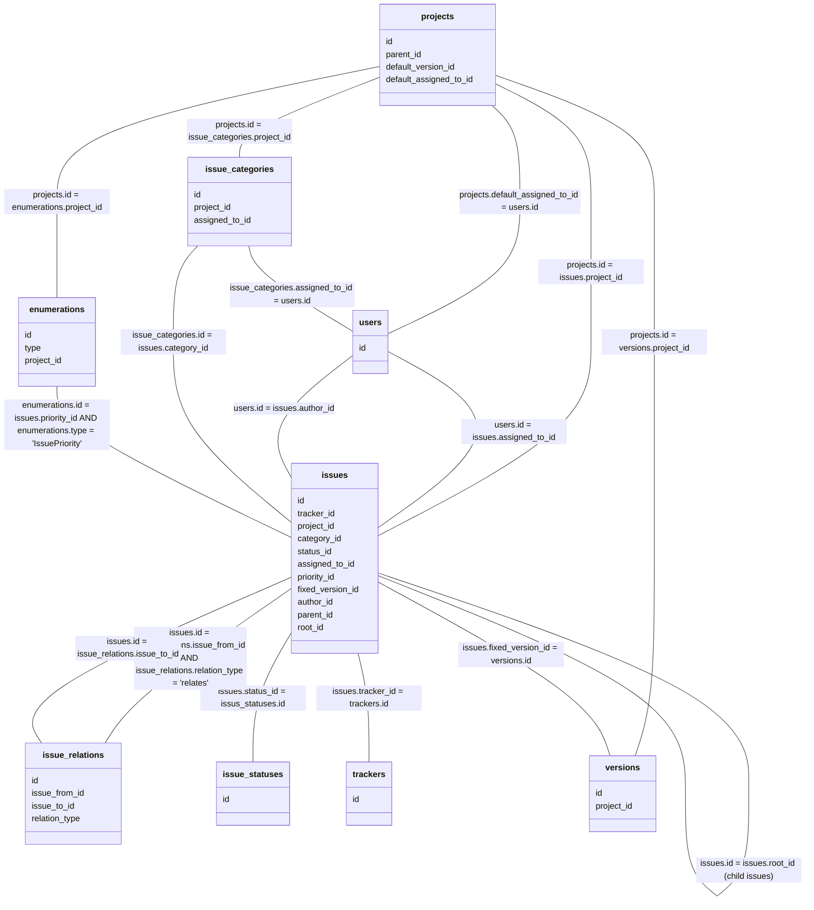
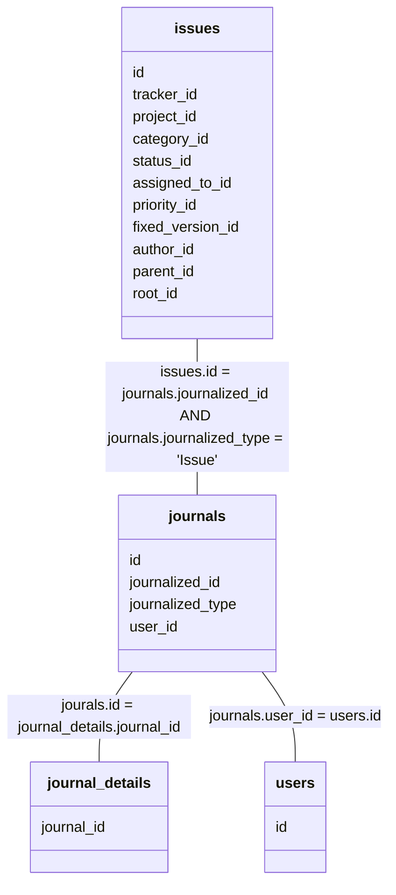
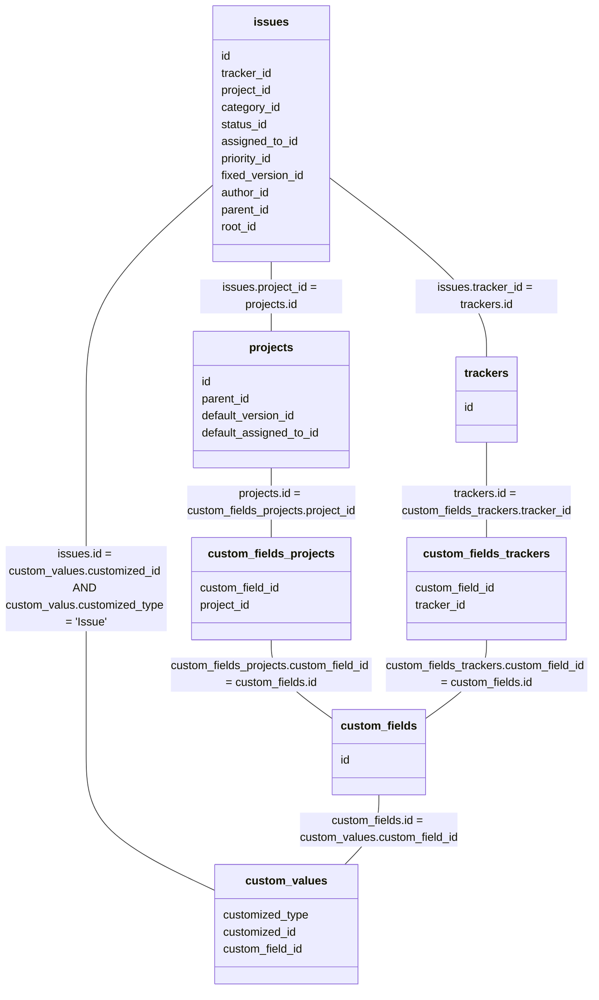
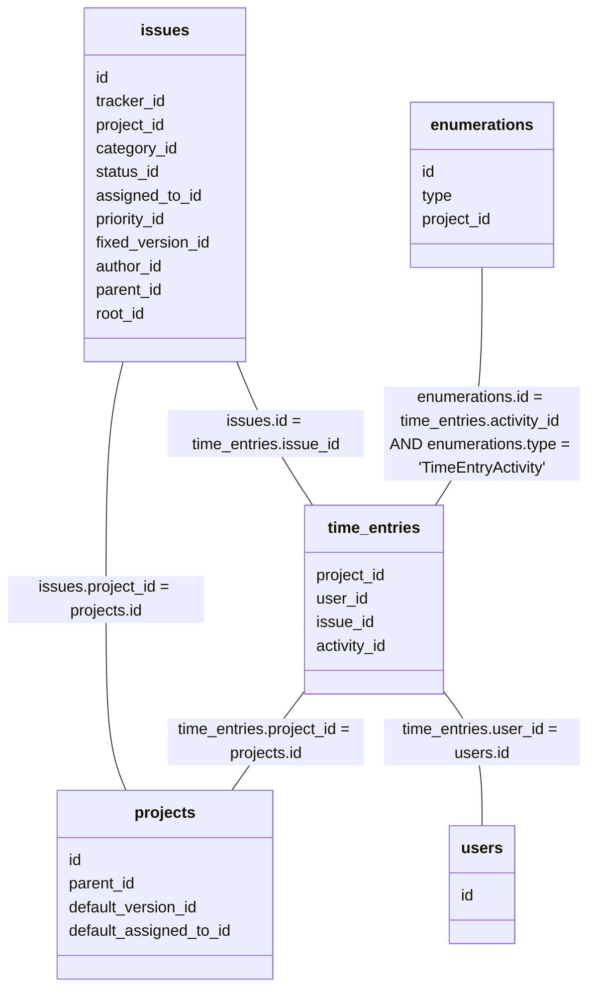
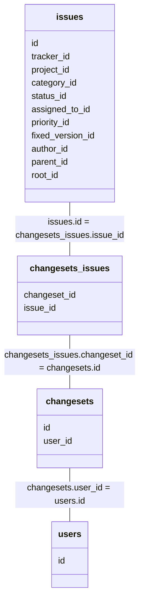
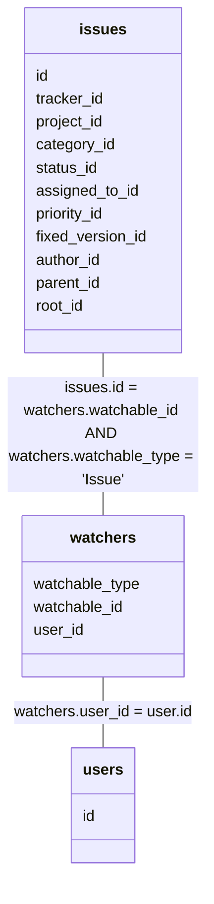

# データベース

## 関連 (チケット)

## 関連 (チケットとコメント)

## 関連 (チケットとカスタムフィールド)

## 関連 (チケットと作業時間)

## 関連 (チケットとリポジトリ)

## 関連 (チケットとウォッチャー)

## changesets

| 型       | カラム名         |
| :------: | :--------------: |
| integer  | id               |
| integer  | repository_id    |
| string   | revision         |
| string   | committer        |
| datetime | comitted_on      |
| string   | comments         |
| date     | comit_date       |
| string   | scmid            |
| integer  | user_id          |

## changesets_issues

| 型       | カラム名         |
| :------: | :--------------: |
| integer  | changeset_id     |
| integer  | issue_id         |

## custom_fields

| 型       | カラム名         |
| :------: | :--------------: |
| integer  | id               |
| string   | type             |
| string   | name             |
| string   | field_format     |
| string   | possible_values  |
| string   | regexp           |
| integer  | min_length       |
| integer  | max_length       |
| boolean  | is_required      |
| boolean  | is_for_adll      |
| boolean  | is_filter        |
| integer  | position         |
| boolean  | searchable       |
| string   | default_value    |
| boolean  | editable         |
| boolean  | visible          |
| boolean  | multiple         |
| string   | format_store     |
| string   | description      |

## custom_fields_projects

| 型       | カラム名         |
| :------: | :--------------: |
| integer  | custom_field_id  |
| integer  | project_id       |

## custom_fields_trackers

| 型       | カラム名         |
| :------: | :--------------: |
| integer  | custom_field_id  |
| integer  | tracker_id       |

## custom_values

| 型       | カラム名         |
| :------: | :--------------: |
| integer  | id               |
| string   | customized_type  |
| integer  | customized_id    |
| integer  | custom_field_id  |
| string   | value            |

## enumerations

| 型       | カラム名         |
| :------: | :--------------: |
| integer  | id               |
| string   | name             |
| integer  | position         |
| boolean  | is_default       |
| string   | type             |
| boolean  | active           |
| integer  | project_id       |
| integer  | parent_id        |
| string   | position_name    |

## issue_categories

| 型       | カラム名         |
| :------: | :--------------: |
| integer  | id               |
| integer  | project_id       |
| string   | name             |
| integer  | assigned_to_id   |

## issue_relations

| 型       | カラム名           |
| :------: | :----------------: |
| integer  | id                 |
| integer  | issue_from_id      |
| integer  | issue_to_id        |
| string   | relation_type      |
| integer  | delay              |

## issue_statuses

| 型       | カラム名           |
| :------: | :----------------: |
| integer  | id                 |
| string   | name               |
| boolean  | is_closed          |
| integer  | position           |
| integer  | default_done_ratio |

## issues

| 型       | カラム名         |
| :------: | :--------------: |
| integer  | id               |
| integer  | tracker_id       |
| integer  | project_id       |
| string   | subject          |
| string   | description      |
| date     | due_date         |
| integer  | category_id      |
| integer  | status_id        |
| integer  | assigned_to_id   |
| integer  | priority_id      |
| integer  | fixed_version_id |
| integer  | author_id        |
| integer  | lock_version     |
| datetime | created_on       |
| datetime | updated_on       |
| date     | start_date       |
| integer  | done_ratio       |
| double   | estimated_hours  |
| integer  | parent_id        |
| integer  | root_id          |
| integer  | lft              |
| integer  | rgt              |
| boolean  | is_private       |
| datetime | cloed_on         |

`lock_version` は rails の [Optimistic Locking](https://guides.rubyonrails.org/active_record_querying.html#optimistic-locking) で使用する。

## journal_details

| 型       | カラム名         |
| :------: | :--------------: |
| integer  | id               |
| integer  | journal_id       |
| string   | property         |
| string   | prop_key         |
| string   | old_value        |
| string   | value            |

`property` が `attr` の場合は `prop_key` に `issues` のプロパティ名が格納される。
`property` が `cf` の場合は `prop_key` に `custom_fields.id` が格納される。

## journals

| 型       | カラム名         |
| :------: | :--------------: |
| integer  | id               |
| integer  | journalized_id   |
| string   | journalized_type |
| integer  | user_id          |
| string   | notes            |
| datetime | created_on       |
| boolean  | private_notes    |

## projects

| 型       | カラム名               |
| :------: | :--------------------: |
| integer  | id                     |
| string   | name                   |
| string   | description            |
| string   | homepage               |
| boolean  | is_public              |
| integer  | parent_id              |
| datetime | created_on             |
| datetime | updated_on             |
| string   | identifier             |
| integer  | status                 |
| integer  | lft                    |
| integer  | rgt                    |
| boolean  | inherit_members        |
| integer  | default_version_id     |
| integer  | default_assigned_to_id |

## time_entries

| 型       | カラム名         |
| :------: | :--------------: |
| integer  | id               |
| integer  | project_id       |
| integer  | user_id          |
| integer  | issue_id         |
| double   | hours            |
| string   | comments         |
| integer  | activity_id      |
| date     | spent_on         |
| integer  | tryear           |
| integer  | tmonth           |
| integer  | tweek            |
| datetime | created_on       |
| datetime | updated_on       |

## trackers

| 型       | カラム名           |
| :------: | :----------------: |
| integer  | id                 |
| string   | name               |
| boolean  | is_in_chlog        |
| integer  | position           |
| boolean  | is_in_roadmap      |
| integer  | fields_bits        |
| integer  | default_status_id  |

## users

| 型       | カラム名           |
| :------: | :----------------: |
| integer  | id                 |
| string   | login              |
| string   | hashed_password    |
| string   | firstname          |
| string   | lastname           |
| boolean  | admin              |
| integer  | status             |
| datetime | last_login_on      |
| strng    | language           |
| integer  | auth_source_id     |
| datetime | created_on         |
| datetime | updated_on         |
| string   | type               |
| string   | identity_url       |
| string   | mail_notification  |
| string   | salt               |
| boolean  | must_change_passed |
| datetime | passed_changed_on  |

## versions

| 型       | カラム名           |
| :------: | :----------------: |
| integer  | id                 |
| integer  | project_id         |
| string   | name               |
| string   | description        |
| date     | effective_date     |
| datetime | created_on         |
| datetime | updated_on         |
| string   | wiki_page_title    |
| string   | status             |
| string   | sharing            |

## watchers

| 型       | カラム名           |
| :------: | :----------------: |
| integer  | id                 |
| string   | watchable_type     |
| integer  | watchable_id       |
| integer  | user_id            |

## 参照

- [Database Model](https://www.redmine.org/projects/redmine/wiki/DatabaseModel)
